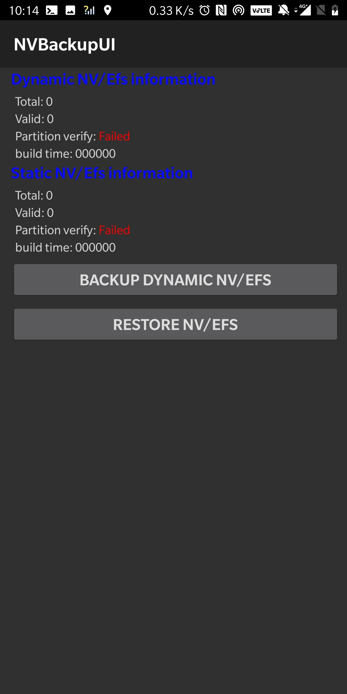

# ca-combos-editor

A combo editor for NV ITEM 00028874 (RFNV_LTE_CA_BW_CLASS_COMBO_I)

## Dislaimer
The file generated by this tool may brick your device. Make a backup of your EFS before doing anything else.  
I suggest you to always keep QRCT open, NSG closed and test your file as follows:

1. Open a root terminal on your phone: `dmesg -w | grep failure` and keep it running.
This will show all the modem errors that may happen if your file is invalid.
2. Use QRCT and EFS Explorer to upload your file and synchronize the EFS. If your modem bootloops, just put the
phone in FTM (it will stop it from bootlooping) and restore the original 00028874 file / try a new one.  

## Setup
1. Clone this repo
2. Execute the following (in the repo's root)
```
go get github.com/denysvitali/ca-combos-editor/cmd
go run cmd/main.go -h
```

## Usage

### Parse 00028774's content
1. Extract it:
```
zlib-flate --uncompress < 00028774 > extracted.bin
```

2. Parse it:
```
go run cmd/main.go parse extracted.bin
```

### Create a 00028774 file based on a band file
  
1. Provide a bands.txt file in the format shown in `test/resources/2019-10-17/bands.txt` (one combo per line)  
2. `go run cmd/main.go create bands.txt 00028774_uncompressed`
3. Compress it: `./compress.sh 00028774_uncompressed`
4. Write the new 00028774 file to your modem

### Create a 00028874 file based on a Downlink file and an Uplink file
Given two files, _downlink.txt_ and _uplink.txt_, containing a list of
downlink bands and uplink bands as follows:  

#### downlink.txt
```
1C
1A-1A
3C
3A-1A
```

#### uplink.txt
```
1A
1A
3A
1A, 3A
```

The following records will be created:
```
DL: 1C                                       
UL: 1A                                       
                                             
DL: 1A-1A                                    
UL: 1A                                       
                                             
DL: 3C                                       
UL: 3A                                       
                                             
DL: 3A-1A                                    
UL: 1A                                       
UL: 3A               
```

The command to parse such files is the following:

```
./ca-combos-editor create_dlul downlink.txt uplink.txt output
```

A new file `output` will be generated. Compress it with `./compress.sh output`
and you'll get the 00028874 file.

## FAQ

### My 00028874 file doesn't get applied and I'm using a Oneplus / Oppo device
Oneplus does rewrite the NV Item files via its "NV Backup". Use a patched `/vendor/bin/rmt_storage` to avoid that
(extract it from any other device with an identical chipset). You can find the one I'm using on my OP5T on Android 9 (Oxygen OS 9.0.9)
in `resources/rmt_storage_patch/op5t/oos/9.0.9/rmt_storage` (see its checksum below).   
This will completely disable the NV Backup and will allow
you to rewrite any NV item file without having it rewritten at every reboot. If the patch succeeds you'll have the
following output when you go to the dialer pad, write `*#268#` (2NV) and click "NV parameters":
  
  
```
2ebd9ab966f395f387c888c9c591c8a2b5720204abc2ba2619d2c10d6cc38506  rmt_storage (patched)
d02daf4725be98999a98b240010dabc0ab231b46e47c3d6824c4625d7cb5a87b  rmt_storage (original)
```