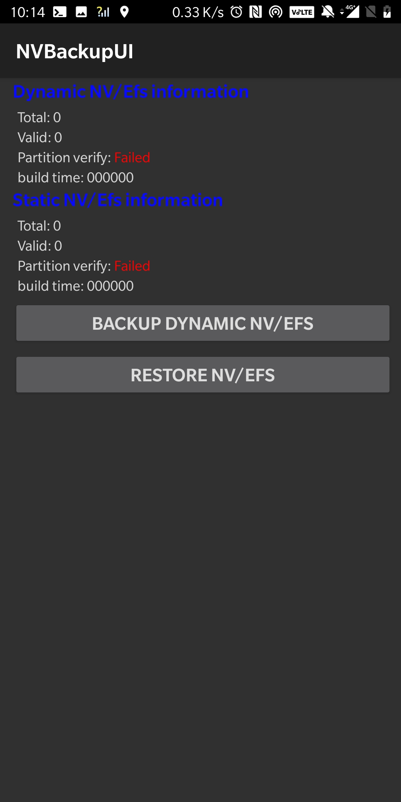

# ca-combos-editor

A combo editor for NV ITEM 00028874 (RFNV_LTE_CA_BW_CLASS_COMBO_I)

## Disclaimer
The file generated by this tool may brick your device. Make a backup of your EFS before doing anything else.
I suggest you to always keep QRCT open, NSG closed and test your file as follows:

1. Open a root terminal on your phone: `dmesg -w | grep failure` and keep it running.
This will show all the modem errors that may happen if your file is invalid.
2. Use QRCT and EFS Explorer to upload your file and synchronize the EFS. If your modem bootloops, just put the
phone in FTM (it will stop it from bootlooping) and restore the original 00028874 file / try a new one.

## Setup

1. Clone this repo
2. From the repo's root, run:
```
go run cmd/main.go --help
```

Or build the binary:
```
go build -o ca-combos-editor cmd/main.go
./ca-combos-editor --help
```

## Usage

```
ca-combos-editor [global flags] <command> [args]
```

### Global Flags

| Flag | Short | Default | Description |
|------|-------|---------|-------------|
| `--log-level` | `-l` | `error` | Set the logging level: `debug`, `info`, `warn`, `error` |
| `--mode` | `-m` | `137` | Writer mode: `137` (legacy), `201` (MIMO), or `333` (antenna-aware) |

### Environment Variables

All flags can also be set via environment variables prefixed with `CA_COMBOS_`:

| Variable | Equivalent Flag | Example |
|----------|-----------------|---------|
| `CA_COMBOS_LOG_LEVEL` | `--log-level` | `CA_COMBOS_LOG_LEVEL=debug` |
| `CA_COMBOS_MODE` | `--mode` | `CA_COMBOS_MODE=201` |
| `CA_COMBOS_MODE` | `--mode` | `CA_COMBOS_MODE=333` |

A configuration file named `ca-combos-editor.yaml` (or one in `$HOME/.config/ca-combos-editor`) is also supported.

### Commands

#### `parse` - Parse an uncompressed 00028874 payload

1. Extract the NV item:
```
ca-combos-editor decompress 00028874 extracted.bin
```

Or with `zlib-flate`:
```
zlib-flate --uncompress < 00028874 > extracted.bin
```

2. Parse it:
```
ca-combos-editor parse extracted.bin
```

With verbose logging:
```
ca-combos-editor --log-level debug parse extracted.bin
```

#### `create` - Create a 00028874 payload from a single bands file

1. Provide a `bands.txt` file in the format shown in `test/resources/2019-10-17/bands.txt` (one combo per line)
2. Generate the payload:
```
ca-combos-editor create bands.txt 00028874_uncompressed
```
3. Compress it:
```
ca-combos-editor compress 00028874_uncompressed 00028874
```

Or with the helper script:
```
./compress.sh 00028874_uncompressed
```
4. Write the new `00028874` file to your modem

Use writer mode 201 or 333 if needed:
```
ca-combos-editor --mode 201 create bands.txt 00028874_uncompressed
ca-combos-editor --mode 333 create bands.txt 00028874_uncompressed
```

#### `create-dlul` - Create a payload from separate downlink and uplink files

Given two files, _downlink.txt_ and _uplink.txt_, containing a list of
downlink bands and uplink bands as follows:

##### downlink.txt
```
1C
1A-1A
3C
3A-1A
```

##### uplink.txt
```
1A
1A
3A
1A, 3A
```

The following records will be created:
```
DL: 1C
UL: 1A

DL: 1A-1A
UL: 1A

DL: 3C
UL: 3A

DL: 3A-1A
UL: 1A
UL: 3A
```

Generate the payload with:
```
ca-combos-editor create-dlul downlink.txt uplink.txt output
```

A new file `output` will be generated. Compress it with `ca-combos-editor compress output 00028874`
or with `./compress.sh output` to get the final `00028874` file.

#### `decompress` / `compress` - Manage the zlib wrapper directly

These commands wrap/unwrap the raw zlib layer without needing `zlib-flate`:

```
# Extract the payload from a raw 00028874 file
ca-combos-editor decompress 00028874 extracted.bin

# Create a raw 00028874 file from an extracted payload
ca-combos-editor compress extracted.bin 00028874
```

## FAQ

### My 00028874 file doesn't get applied and I'm using a Oneplus / Oppo device
Oneplus does rewrite the NV Item files via its "NV Backup". Use a patched `/vendor/bin/rmt_storage` to avoid that
(extract it from any other device with an identical chipset). You can find the one I'm using on my OP5T on Android 9 (Oxygen OS 9.0.9)
in `resources/rmt_storage_patch/op5t/oos/9.0.9/rmt_storage` (see its checksum below).
This will completely disable the NV Backup and will allow
you to rewrite any NV item file without having it rewritten at every reboot. If the patch succeeds you'll have the
following output when you go to the dialer pad, write `*#268#` (2NV) and click "NV parameters":

<p align="center">

</p>


```
2ebd9ab966f395f387c888c9c591c8a2b5720204abc2ba2619d2c10d6cc38506  rmt_storage (patched)
d02daf4725be98999a98b240010dabc0ab231b46e47c3d6824c4625d7cb5a87b  rmt_storage (original)
```
